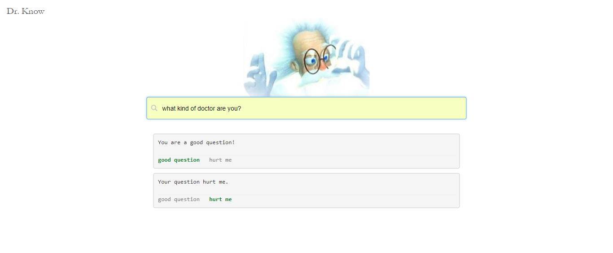

# Dr. Know
> Starving minds, welcome to Dr. Know! 

A Spring Boot, thymeleaf Java demo application for searching questions and answers.

<br>


## Setup and Run
- Git checkout the project and run following command
- Application will start on http://localhost:8080

```shell
$ mvn spring-boot:run
```

## License

MIT © [Deependra Mishra](https://www.linkedin.com/in/deependrax/)